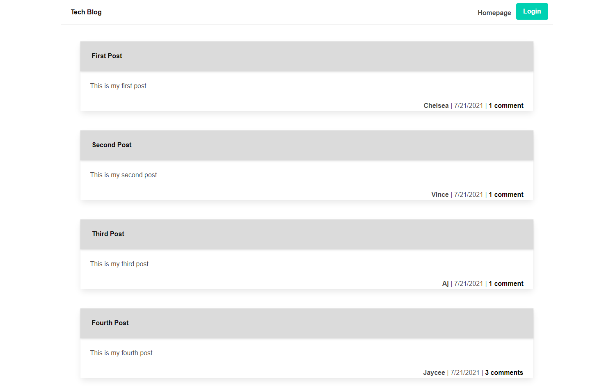

# Tech.Blog

[](https://choosealicense.com/licenses/bsd-3-clause/)

## Description

  Writing about tech can be just as important as making it. Developers spend plenty of time creating new applications and debugging existing codebases, but most developers also spend at least some of their time reading and writing about technical concepts, recent advancements, and new technologies. A simple Google search for any concept covered in this course returns thousands of think pieces and tutorials from developers of all skill levels!

  Your task this week is to build a CMS-style blog site similar to a Wordpress site, where developers can publish their blog posts and comment on other developers’ posts as well. You’ll build this site completely from scratch and deploy it to Heroku. Your app will follow the MVC paradigm in its architectural structure, using Handlebars.js as the templating language, Sequelize as the ORM, and the express-session npm package for authentication.
  
  
## Table of Contents
  * [Installation](#installation)
  * [Usage](#usage)
  * [Links](#links)
  * [License](#license)
  * [Questions](#questions)
  
## Installation

  Make sure to have node.js installed before running the aplication, if not please go to: https://nodejs.org/en/download/package-manager/

  After node.js is installed, enter the following:

  ```
  npm init
  npm install
  ```

## Usage

  Run the following command to start the server:

  ```
  npm run start
  ```

## Links

  * Application URL: https://itsnestor.github.io/Tech.Blog/
  * Github Repository URL: https://github.com/itsnestor/Tech.Blog

  
  
  
## License

  [](https://choosealicense.com/licenses/bsd-3-clause/)
  

## Questions

  [](https://github.com/itsnestor)

  Reach out to me at nestor.dejoya.campaner@gmail.com with any questions about the project.